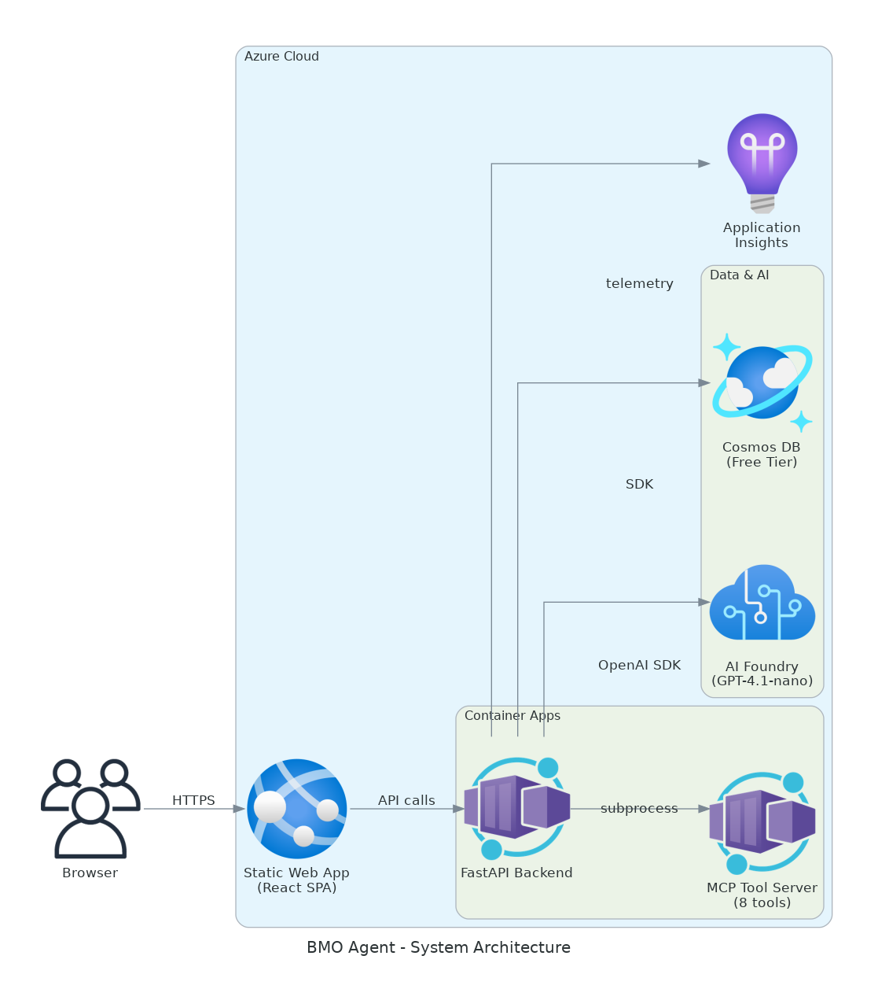
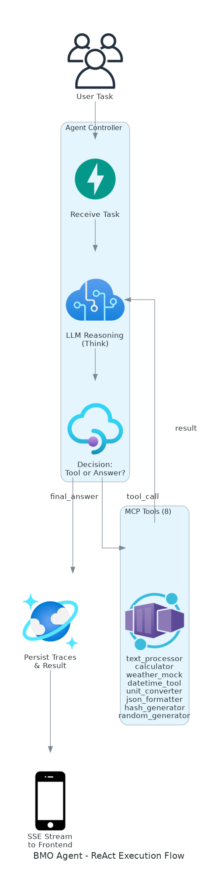
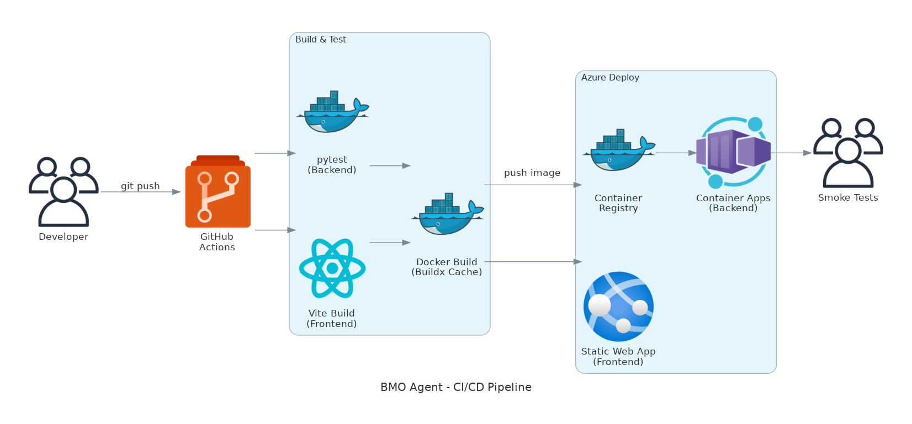

# BMO Agent - Agentic Execution Framework

A production-grade AI agent system with dual-mode deployment: local (Ollama + SQLite) and cloud (Azure Foundry + Cosmos DB). The system interprets natural language tasks, reasons using a ReAct loop, executes 8 deterministic tools via the Model Context Protocol (MCP), and streams results in real-time.



For a deeper dive into the codebase architecture, API design, and internal logic, please refer to the [docs/](docs/) directory, which contains comprehensive UML-related and codebase documentation (e.g., `architecture.md`, `backend_api.md`, `llm_configuration.md`, `mcp_tools.md`).

---

## Technical Stack Overview

This project is built using modern, scalable technologies, clearly separated into distinct tiers to ensure maintainability and deployment flexibility.

### 🧠 LLM / AI Stack
- **Agent Architecture:** ReAct (Reasoning and Acting) loop for multi-step problem solving.
- **Local AI:** Ollama running `qwen2.5:0.5b` for fast, cost-free local development and testing.
- **Cloud AI:** Microsoft Foundry (Azure AI) running `gpt-4.1-nano` for production workloads, featuring built-in content safety, prompt evaluation, and an enterprise SLA.
- **Tool Orchestration:** Model Context Protocol (MCP) server managing 8 distinct tools (text processing, calculation, weather mocking, datetime manipulation, etc.).

### ☁️ Cloud & Infrastructure Stack
- **Infrastructure as Code (IaC):** Terraform (`azurerm` provider) managing the entire Azure footprint.
- **Hosting (Compute):** Azure Container Apps (Consumption tier) for auto-scaling, scale-to-zero backend microservices. Azure Static Web Apps for globally distributed frontend CDN hosting.
- **Data Persistence:** Azure Cosmos DB (Free Tier NoSQL) for scalable, globally distributed document storage. Local development gracefully falls back to SQLite via a repository abstraction layer.
- **Security:** Azure Key Vault for secure storage of access tokens and secrets.
- **Observability:** Azure Application Insights providing distributed tracing, log aggregation, and real-time telemetry.
- **Containerization:** Docker & Docker Compose for isolated execution environments and ACR (Azure Container Registry) for cloud image distribution.

### ⚙️ Backend Stack
- **Framework:** FastAPI (Python 3.11+) providing high-performance asynchronous endpoints and WebSocket/SSE streaming.
- **ORM / Data Validation:** SQLModel (Pydantic + SQLAlchemy) handling data schemas and database migrations.
- **Real-Time Streaming:** `sse-starlette` delivering execution traces to the frontend in real time.

### 🖥️ Frontend Stack
- **Framework:** React 18 + Vite + TypeScript.
- **Design System:** Custom CSS providing a "Terminal Luxe" aesthetic tailored for internal agent interactions.

---

## Core Workflows & Diagrams

### Agent Execution Flow

The agent utilizes a ReAct loop to iteratively break down complex tasks, select the appropriate tools, and evaluate the results before arriving at a final answer.



### CI/CD Pipeline

Continuous Integration and Continuous Deployment are managed via GitHub Actions. Every push triggers a **5-stage pipeline** with unit tests both pre- and post-deploy:

| Stage | Job | What it does |
|-------|-----|-------------|
| 1 | `backend-test` | Runs **pytest** unit test suite (90+ tests across `test_main.py` + `test_extended.py`) against all backend modules |
| 2 | `frontend-build` | ESLint + TypeScript check + Vite production build |
| 3 | `docker-build` | Docker Buildx with layer caching (validates image builds) |
| 4 | `deploy` | Push image to ACR → update Container App → deploy SWA frontend |
| 5 | `post-deploy-test` | **Smoke tests against live deployment** (health, task creation, task listing) |

All stages use **dependency caching** (pip, npm, Docker layers) for fast CI runs.



---

## Quick Start

### Local Development (Docker)

```bash
# Ensure Ollama is running locally
ollama serve &
ollama pull qwen2.5:0.5b

# Start all services (Frontend, Backend, SQLite DB)
docker compose up --build

# Frontend: http://localhost:3000
# Backend:  http://localhost:8000
# Swagger:  http://localhost:8000/docs
```

### Local Development (Manual Setup)

```bash
# 1. Start the Backend
cd backend
pip install -r requirements.txt
uvicorn main:app --reload --port 8000

# 2. Start the Frontend (in a new terminal)
cd frontend
npm install && npm run dev
```

---

## MCP Tools (8 Included)

The agent has access to 8 modular tools via the MCP protocol. For full technical details on adding or modifying tools, see [`docs/mcp_tools.md`](docs/mcp_tools.md).

| # | Tool | Description | Example |
|---|------|-------------|---------|
| 1 | `text_processor` | String ops (upper, lower, wordcount, reverse, title) | `text_processor("hello", "uppercase")` → `"HELLO"` |
| 2 | `calculator` | Safe AST-based arithmetic | `calculator("(3+5)*2")` → `"16"` |
| 3 | `weather_mock` | Deterministic synthetic weather | `weather_mock("Tokyo")` → `{"temp": 31}` |
| 4 | `datetime_tool` | Current time, date math, formatting | `datetime_tool("add_days", "2024-01-01", days=90)` |
| 5 | `unit_converter` | Temp/length/weight/volume conversion | `unit_converter(100, "F", "C")` → `37.78` |
| 6 | `json_formatter` | Validate, prettify, minify, extract keys | `json_formatter('{"a":1}', "prettify")` |
| 7 | `hash_generator` | MD5, SHA-1, SHA-256, SHA-512 | `hash_generator("hello", "sha256")` |
| 8 | `random_generator` | Random numbers, UUIDs, passwords | `random_generator("password", length=16)` |

---

## Azure Deployment Guide

### Prerequisites

- Azure CLI (`az login` authenticated)
- Terraform >= 1.5
- GitHub repository with configured secrets

### Deploy with Terraform

```bash
cd infra
terraform init
terraform plan
terraform apply
```

### Required GitHub Secrets for CI/CD

| Secret Name | Description / Source |
|-------------|----------------------|
| `AZURE_CREDENTIALS` | Generated via `az ad sp create-for-rbac` |
| `SWA_DEPLOYMENT_TOKEN` | Output from `terraform output swa_deployment_token` |
| `BACKEND_URL` | Output from `terraform output backend_url` |

---

## Application Environment Variables

The system architecture seamlessly toggles between local and cloud modes using the following environment variables:

| Variable | Local Default | Cloud Value (Azure) |
|----------|---------------|---------------------|
| `LLM_PROVIDER` | `ollama` | `foundry` |
| `DATABASE_BACKEND` | `sqlite` | `cosmos` |
| `OLLAMA_HOST` | `http://localhost:11434` | — |
| `OLLAMA_MODEL` | `qwen2.5:0.5b` | — |
| `FOUNDRY_ENDPOINT` | — | AI Foundry URL |
| `FOUNDRY_API_KEY` | — | Extracted via Azure Identity |
| `FOUNDRY_MODEL` | `gpt-4.1-nano` | `gpt-4.1-nano` |
| `COSMOS_ENDPOINT` | — | Cosmos DB Connection URL |
| `COSMOS_KEY` | — | Managed via Azure Key Vault |
| `APPLICATIONINSIGHTS_CONNECTION_STRING` | — | App Insights Connection String |
| `KEY_VAULT_URL` | — | Azure Key Vault Endpoint URL |

---

## Azure AI Foundry — Production Managed Services

In the production Azure environment, the system leverages **Microsoft Azure AI Foundry** (formerly Azure OpenAI + Azure AI Studio) as the managed AI platform. Below is how each Foundry service would orchestrate the multi-agent system:

| Foundry Service | How We Use It | Purpose |
|----------------|---------------|---------|
| **Model Deployments** | GPT-4.1-nano deployed via `azurerm_cognitive_deployment` | Primary LLM for tool-calling agent (cheapest model with function calling) |
| **Content Safety** | Built-in content filters on every model deployment | Blocks harmful prompts/outputs before they reach users — no custom code needed |
| **Prompt Flow** | Orchestrates multi-step agent reasoning chains | Would replace our custom ReAct loop with a visual, versioned, testable flow |
| **Model Catalog** (1900+ models) | Access GPT-4o, Claude, Mistral, Llama without infra changes | Enables model routing — GPT-4o for planning, GPT-4.1-nano for tools, Claude for code review |
| **Evaluation** | Automated quality scoring of agent outputs | CI/CD integration — fail deployments if eval scores regress below threshold |
| **Tracing** | Built-in LLM call tracing with token counts + latency | Feeds into App Insights for cost attribution per-agent per-task |
| **Fine-Tuning** | Custom model training on domain-specific data | Train a specialized tool-calling model on our 8 MCP tools for better accuracy |
| **Agent Service** | Managed agent hosting with tool definitions | Production replacement for our subprocess-based MCP server — Azure manages scaling |
| **Connections** | Secure credential store for external APIs | Connects to Azure AI Search, Bing, custom APIs without exposing keys in code |
| **Responsible AI** | Fairness analysis, explainability, PII detection | Compliance layer — audit trail of all LLM decisions with bias/harm scoring |

### Orchestration Architecture (Production)

```
User Request → API Management → Prompt Flow (Orchestrator)
    ├── Step 1: Intent Classification (GPT-4.1-nano, 0.1s)
    ├── Step 2: Plan Generation (GPT-4o, 2s)
    ├── Step 3: Tool Execution (Agent Service → MCP tools)
    ├── Step 4: Response Synthesis (GPT-4.1-nano, 0.5s)
    └── Step 5: Content Safety Check → Response
    
All steps traced → Foundry Tracing → App Insights → Log Analytics
Eval scores checked post-response → flag regressions → alert team
```

### Why Foundry Over Raw OpenAI API

| Concern | Raw API | Azure AI Foundry |
|---------|---------|-----------------|
| Content filtering | DIY (prompt engineering) | Built-in, configurable severity levels |
| Model versioning | Manual `model` string management | Deployment-level versioning with A/B testing |
| Scaling | Self-managed rate limits | Auto-scaling with PTU (Provisioned Throughput Units) |
| Compliance | SOC2 via OpenAI | SOC2 + ISO27001 + HIPAA + FedRAMP via Azure |
| Multi-model | Multiple API keys | Single endpoint, model routing via deployment names |
| Observability | Custom logging | Native tracing with token-level cost attribution |
| Guardrails | Custom middleware | Responsible AI dashboard + blocklists + PII filters |

> **Current implementation**: We use `FoundryLLMClient` in `backend/llm_client.py` which calls the Azure OpenAI-compatible endpoint. This is the entry point — migrating to full Prompt Flow orchestration requires only changing the agent loop, not the client interface.

---

## Authentication & RBAC

The cloud deployment uses a lightweight **email + access token** system scoped for this coding challenge:
- **Allowed Users**: Pre-registered email addresses hardcoded in `auth.py`.
- **Login Mechanism**: Email + generated access token pairing via `POST /api/auth/init`.
- **Secure Storage**: Tokens are stored securely in **Azure Key Vault** (the Container App authenticates via its System-Assigned Managed Identity — no credentials in environment variables).
- **Local Fallback**: Auth is bypassed in local dev unless `KEY_VAULT_URL` or `AUTH_ENABLED` is set.

> **⚠️ Production Note**: In a real enterprise deployment, this custom token system would be replaced entirely with **Microsoft Entra ID (Azure AD)** using **Security Groups** for role-based access. Users would SSO with their existing corporate credentials — no shadow IDs, no manual token management. The frontend would use `@azure/msal-react` for OAuth 2.0 flows and the backend would validate short-lived JWTs with group membership checks. The architecture is designed so only `auth.py` needs to change to adopt this pattern.
>
> See [`docs/backend_api.md`](docs/backend_api.md#authentication--current-implementation--production-roadmap) for a full comparison and code example.

---

## Documentation Index

For in-depth, code-level documentation and UML diagrams, please review the files inside the `docs/` folder:
- **[System Architecture](docs/architecture.md)**
- **[Backend API Design](docs/backend_api.md)**
- **[Database Schema & Data Storage](docs/database_schema.md)** — Complete table definitions, UUID strategy, execution trace structure (what the agent "stack trace" looks like in the DB), Cosmos DB JSON format, cascade deletion, and query examples.
- **[LLM Configuration & Integrations](docs/llm_configuration.md)**
- **[MCP Tooling Protocol](docs/mcp_tools.md)**
- **[Production Multi-Agent Architecture](docs/production_multi_agent_architecture.md)** — Full vision for a productionized MAS with detailed Azure cloud diagrams (Entra ID, zero-trust networking, Service Bus orchestration, agent-enhanced CI/CD with canary rollouts, and distributed observability stack).

*(Note: Frontend-specific UI documentation is deliberately kept light in favor of heavier backend and system design documentation).*

---

## License

Built as a coding challenge submission for BMO.
