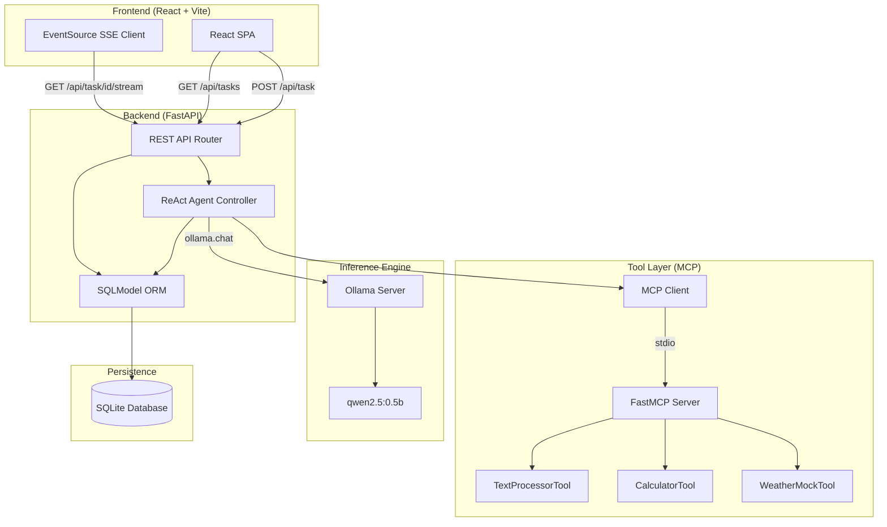
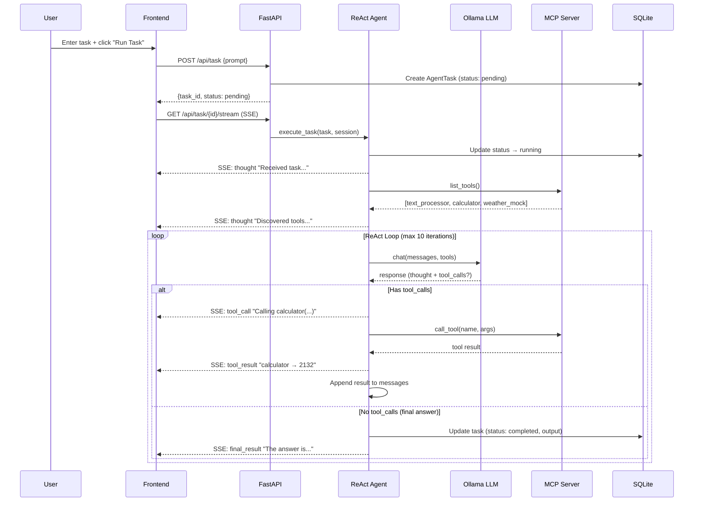
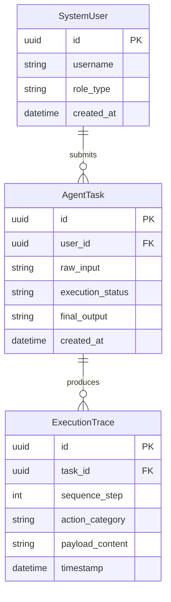

# System Architecture

This document provides a detailed architectural overview of the Agentic Execution Framework, including data flow diagrams, component responsibilities, and design rationale.

---

## High-Level Architecture

---

## ReAct Loop Sequence

The agent uses a Reasoning + Acting (ReAct) pattern to solve tasks. Here is the sequence for a typical task:

---

## Database Entity Relationship

### Entity Descriptions

| Entity | Purpose |
|---|---|
| **SystemUser** | Represents an authenticated user. Supports RBAC with `role_type` (admin/user). Auto-created when tasks are submitted without a user_id. |
| **AgentTask** | A single user-submitted task. Tracks the raw prompt, current status (`pending` → `running` → `completed`/`failed`), and the final output. |
| **ExecutionTrace** | One step in the agent's reasoning chain. Categories: `thought`, `tool_call`, `tool_result`, `tool_error`, `final_result`. Ordered by `sequence_step`. |

---

## Component Responsibilities

### Frontend (React SPA)
- **Task submission**: Sends `POST /api/task` and immediately connects to the SSE stream
- **Real-time rendering**: Parses SSE events and renders trace steps with color-coded badges
- **History browsing**: Fetches `GET /api/tasks` and `GET /api/task/{id}` for drill-down inspection
- **Error handling**: Displays error banners when backend is unreachable

### Backend (FastAPI)
- **API layer** (`router.py`): RESTful endpoints with Pydantic validation, UUID parsing, HTTP error codes
- **Agent controller** (`agent.py`): ReAct loop with bounded iterations, retry/backoff, SSE event emission
- **Persistence** (`database.py`, `models.py`): SQLModel ORM with engine override for testing
- **Startup** (`main.py`): Lifespan-managed table creation, CORS, structured logging

### MCP Tool Server (FastMCP)
- **Isolated subprocess**: Runs as a child process via stdio transport — completely decoupled
- **Tool registration**: Each tool is a decorated Python function with typed parameters
- **Schema generation**: FastMCP auto-generates JSON Schema for tool parameters

### Ollama (Local LLM)
- **Inference engine**: Runs `qwen2.5:0.5b` (or any compatible model) locally
- **Function calling**: Supports the Ollama tool-calling protocol for structured tool selection
- **Zero-cost**: No API keys, no external network calls, full data privacy

---

## Design Decisions

| Decision | Why | Tradeoff |
|---|---|---|
| **MCP over direct calls** | Genuine tool isolation; add new tools without touching agent code | Adds subprocess overhead (~50ms per call) |
| **SSE over WebSockets** | Unidirectional, lightweight, works through corporate proxies | No bidirectional communication |
| **SQLite over PostgreSQL** | Zero setup for local dev; SQLModel makes migration trivial | No concurrent write scaling |
| **Bounded ReAct loop** | Prevents runaway LLM loops consuming resources | May truncate genuinely complex tasks |
| **Retry with backoff** | Handles transient Ollama/CUDA/network failures | Adds latency on failures (up to ~7s for 3 retries) |
