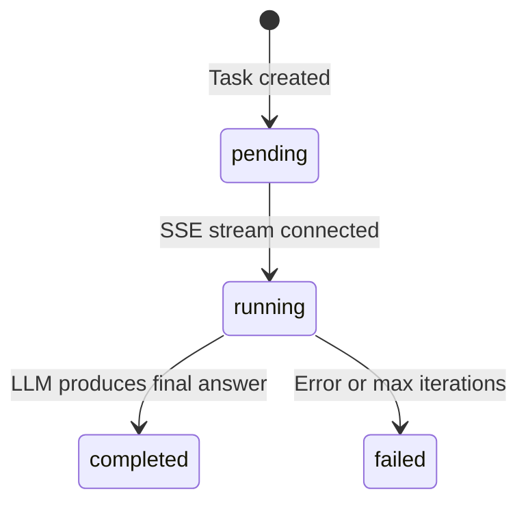

# Backend API Reference

This document provides a complete reference for the FastAPI backend, including all endpoints, request/response schemas, and error codes.

---

## Base URL

- **Local development**: `http://localhost:8000`
- **Docker**: `http://localhost:8000` (or via nginx proxy at `http://localhost:3000/api/`)

---

## Endpoints

### `GET /`

Root health check confirming the API is operational.

**Response** `200 OK`
```json
{
  "message": "Agentic Execution Framework API is running",
  "version": "1.0.0"
}
```

---

### `GET /api/health`

Service readiness probe for Docker health checks and load balancers.

**Response** `200 OK`
```json
{
  "status": "healthy"
}
```

---

### `GET /api/ollama/status`

Check Ollama LLM connectivity and model availability.

**Response** `200 OK`
```json
{
  "status": "connected",
  "host": "http://localhost:11434",
  "configured_model": "qwen2.5:0.5b",
  "model_available": true,
  "available_models": ["qwen2.5:0.5b", "qwen3:8b"]
}
```

---

### `POST /api/task`

Submit a new task for the agent to process.

**Request Body**
```json
{
  "prompt": "What is 52 * 41?",
  "user_id": "optional-uuid-string"
}
```

| Field | Type | Required | Constraints |
|---|---|---|---|
| `prompt` | string | ✅ | 1–2000 characters |
| `user_id` | string | ❌ | Valid UUID; auto-created if absent |

**Response** `200 OK`
```json
{
  "task_id": "a1b2c3d4-e5f6-7890-abcd-ef1234567890",
  "status": "pending"
}
```

**Error Responses**

| Status | Cause |
|---|---|
| `400` | Invalid `user_id` format |
| `422` | Missing or empty `prompt` |

---

### `GET /api/task/{task_id}/stream`

Stream execution traces via Server-Sent Events (SSE). Connect to this endpoint after creating a task to receive real-time updates.

**SSE Event Types**

| Event | Description | Data Format |
|---|---|---|
| `trace_update` | Intermediate step (thought, tool call, result) | `{"step": 0, "type": "thought", "content": "..."}` |
| `final_result` | Agent has completed | `{"step": 5, "type": "final_result", "content": "..."}` |

**Trace Types** (`type` field):

| Type | Description | Color |
|---|---|---|
| `thought` | LLM reasoning step | 🔵 Blue |
| `tool_call` | Tool invocation | 🟡 Amber |
| `tool_result` | Tool response | 🟢 Green |
| `tool_error` | Tool failure | 🔴 Red |
| `final_result` | Synthesized answer | 🟣 Violet |

**Example SSE Stream**
```
event: trace_update
data: {"step": 0, "type": "thought", "content": "Received task: \"What is 52 * 41?\""}

event: trace_update
data: {"step": 1, "type": "thought", "content": "Discovered tools: text_processor, calculator, weather_mock"}

event: trace_update
data: {"step": 2, "type": "tool_call", "content": "Calling calculator({\"expression\": \"52 * 41\"})"}

event: trace_update
data: {"step": 3, "type": "tool_result", "content": "calculator → 2132"}

event: final_result
data: {"step": 5, "type": "final_result", "content": "The result of 52 multiplied by 41 is 2132."}
```

**Error Responses**

| Status | Cause |
|---|---|
| `400` | Invalid `task_id` format |
| `404` | Task not found |

---

### `GET /api/tasks`

List all historical tasks ordered by creation time (most recent first).

**Response** `200 OK`
```json
[
  {
    "id": "a1b2c3d4-...",
    "raw_input": "Calculate 52 * 41",
    "execution_status": "completed",
    "final_output": "The result is 2132.",
    "created_at": "2026-06-13T22:29:00.123456"
  }
]
```

---

### `GET /api/task/{task_id}`

Get a single task with its full execution trace.

**Response** `200 OK`
```json
{
  "id": "a1b2c3d4-...",
  "raw_input": "Calculate 52 * 41",
  "execution_status": "completed",
  "final_output": "The result is 2132.",
  "created_at": "2026-06-13T22:29:00.123456",
  "traces": [
    {
      "step": 0,
      "type": "thought",
      "content": "Received task: \"Calculate 52 * 41\"",
      "timestamp": "2026-06-13T22:29:00.456789"
    },
    {
      "step": 1,
      "type": "tool_call",
      "content": "Calling calculator({\"expression\": \"52 * 41\"})",
      "timestamp": "2026-06-13T22:29:01.234567"
    }
  ]
}
```

**Error Responses**

| Status | Cause |
|---|---|
| `400` | Invalid `task_id` format |
| `404` | Task not found |

---

## Data Models

### AgentTask States



### Execution Status Values

| Status | Description |
|---|---|
| `pending` | Task created, waiting for SSE connection |
| `running` | Agent is actively reasoning |
| `completed` | Final answer produced successfully |
| `failed` | Error occurred or max iterations exceeded |

---

## CORS Configuration

The API allows all origins in development (`allow_origins=["*"]`). For production, restrict to your frontend domain.

## OpenAPI Documentation

FastAPI auto-generates interactive API docs:
- **Swagger UI**: `http://localhost:8000/docs`
- **ReDoc**: `http://localhost:8000/redoc`
