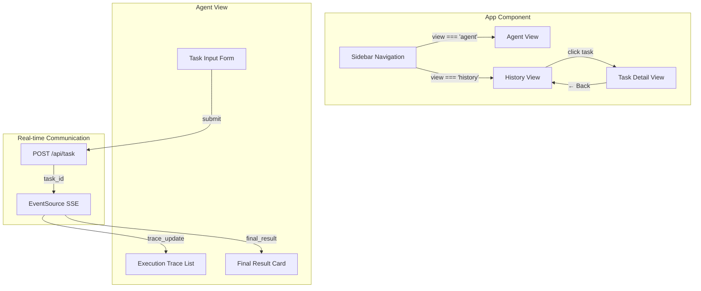

# Frontend Documentation

This document describes the React frontend architecture, component structure, styling system, and configuration.

---

## Overview

The frontend is a single-page application built with React 19, TypeScript, and Vite. It provides two main views:

1. **Agent View** — Submit tasks and watch the agent reason in real time via SSE
2. **History View** — Browse past tasks and inspect their full execution traces



---

## Component Structure

The entire UI lives in a single `App.tsx` component with internal state management:

| State Variable | Type | Purpose |
|---|---|---|
| `prompt` | `string` | Current input field value |
| `traces` | `TraceEvent[]` | Execution traces for the current task |
| `status` | `'idle' \| 'running' \| 'completed' \| 'error'` | Current execution state |
| `finalOutput` | `string \| null` | Final result text |
| `history` | `HistoryTask[]` | All historical tasks |
| `selectedTask` | `HistoryTask \| null` | Currently inspected task (detail view) |
| `view` | `'agent' \| 'history'` | Active sidebar tab |

---

## Real-time Streaming (SSE)

The frontend uses the native `EventSource` API to consume Server-Sent Events:

```typescript
// 1. Create the task
const res = await fetch(`${API_BASE}/api/task`, {
  method: 'POST',
  body: JSON.stringify({ prompt }),
})
const { task_id } = await res.json()

// 2. Connect to SSE stream
const eventSource = new EventSource(`${API_BASE}/api/task/${task_id}/stream`)

// 3. Listen for events
eventSource.addEventListener('trace_update', (e) => {
  const data = JSON.parse(e.data)
  setTraces(prev => [...prev, data])
})

eventSource.addEventListener('final_result', (e) => {
  const data = JSON.parse(e.data)
  setFinalOutput(data.content)
  eventSource.close()
})
```

---

## Styling System

The CSS uses a design tokens approach with CSS custom properties:

### Color Palette

| Token | Value | Usage |
|---|---|---|
| `--bg-primary` | `#0b0f1a` | Main background |
| `--bg-secondary` | `#111827` | Sidebar |
| `--bg-card` | `#1a2233` | Card backgrounds |
| `--accent-blue` | `#3b82f6` | Thoughts, active states |
| `--accent-violet` | `#8b5cf6` | Final results |
| `--accent-emerald` | `#10b981` | Tool results, success |
| `--accent-amber` | `#f59e0b` | Tool calls |
| `--accent-red` | `#ef4444` | Errors |

### Typography

- **Primary**: Inter (Google Fonts)
- **Monospace**: Fira Code (for trace content)

### Trace Color Coding

Each trace type has a distinct left-border color for instant visual identification:

| Trace Type | Border Color | Badge |
|---|---|---|
| `thought` | Blue | 💭 THOUGHT |
| `tool_call` | Amber | 🔧 TOOL CALL |
| `tool_result` | Green | ✅ RESULT |
| `tool_error` | Red | ❌ ERROR |
| `final_result` | Violet | 🏁 FINAL |

### Responsive Design

- **Desktop** (>768px): Sidebar + main panel side-by-side
- **Mobile** (<768px): Sidebar collapses to horizontal top bar

---

## Configuration

### API Base URL

The API URL is configurable via environment variable:

```bash
# During development (default)
VITE_API_URL=http://localhost:8000 npm run dev

# Production build
VITE_API_URL=https://api.yourdomain.com npm run build
```

If not set, it defaults to `http://localhost:8000`.

### Build Commands

```bash
npm install       # Install dependencies
npm run dev       # Start dev server (hot reload)
npm run build     # Production build → dist/
npm run lint      # ESLint check
npm run preview   # Preview production build locally
```

---

## Key UX Decisions

| Decision | Rationale |
|---|---|
| **Auto-scroll on new traces** | Uses `scrollIntoView({ behavior: 'smooth' })` so users always see the latest step |
| **Spinner during execution** | Button shows animated spinner and disables to prevent double-submission |
| **Error banner** | Shows actionable message ("Is the backend running on port 8000?") |
| **History drill-down** | Click any historical task → see full trace with timestamps |
| **Emoji badges** | Faster visual parsing than text-only labels |
