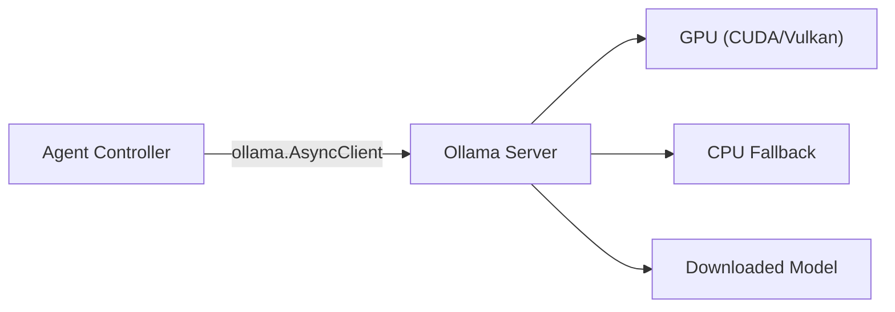

# LLM Configuration Guide

This document covers the Ollama integration, model selection, GPU/CPU configuration, and troubleshooting.

---

## Overview

The agent uses [Ollama](https://ollama.com) as a local inference engine. Ollama runs LLMs entirely on your machine — no API keys, no cloud dependencies, full data privacy.



---

## Supported Models

The framework works with any Ollama model that supports **tool calling**. Here are recommended options sorted by size:

| Model | Size | RAM Required | Tool Calling | Best For |
|---|---|---|---|---|
| `qwen2.5:0.5b` | 397 MB | ~1 GB | ✅ | Testing, CI/CD, low-resource machines |
| `qwen2.5:1.5b` | 986 MB | ~2 GB | ✅ | Light development |
| `qwen2.5:3b` | 1.9 GB | ~4 GB | ✅ | Good balance of speed and quality |
| `qwen2.5:7b` | 4.7 GB | ~8 GB | ✅ | Recommended for reliable tool selection |
| `qwen3:8b` | 5.2 GB | ~8 GB | ✅ | Best reasoning quality |
| `gemma3:4b` | 3.3 GB | ~6 GB | ✅ | Alternative, good reasoning |
| `llama3.2:3b` | 2.0 GB | ~4 GB | ✅ | Alternative small model |

### Installing a Model

```bash
# Install the default model (smallest, ~400 MB)
ollama pull qwen2.5:0.5b

# Or install a larger model for better quality
ollama pull qwen2.5:7b

# List installed models
ollama list
```

### Switching Models

Set the `OLLAMA_MODEL` environment variable:

```bash
# Local development
OLLAMA_MODEL=qwen2.5:7b uvicorn main:app --reload

# Docker
docker compose up -e OLLAMA_MODEL=qwen2.5:7b
```

---

## GPU vs CPU Configuration

### Default (GPU)

Ollama automatically uses GPU acceleration when available:
- **NVIDIA**: CUDA (requires compatible drivers)
- **AMD**: ROCm
- **Apple**: Metal (M1/M2/M3)

### CPU-Only Mode

If you encounter GPU errors like `CUDA error: device kernel image is invalid`, run Ollama in CPU-only mode:

```bash
# Option 1: Environment variable (recommended)
CUDA_VISIBLE_DEVICES="" ollama serve

# Option 2: Force CPU library
OLLAMA_LLM_LIBRARY=cpu ollama serve

# Option 3: Start on a different port to avoid conflicts
CUDA_VISIBLE_DEVICES="" OLLAMA_HOST=127.0.0.1:11435 ollama serve
```

Then point the backend to the correct host:

```bash
OLLAMA_HOST=http://localhost:11435 uvicorn main:app --port 8000
```

### Performance Expectations

| Hardware | Model | Inference Speed |
|---|---|---|
| RTX 4090 (GPU) | qwen2.5:0.5b | ~50 tokens/sec |
| RTX 4090 (GPU) | qwen2.5:7b | ~30 tokens/sec |
| CPU (8-core) | qwen2.5:0.5b | ~10 tokens/sec |
| CPU (8-core) | qwen2.5:7b | ~2-3 tokens/sec |
| Apple M2 (Metal) | qwen2.5:7b | ~15 tokens/sec |

---

## Connectivity & Health Checks

### Verify Ollama is Running

```bash
# Check the Ollama API
curl http://localhost:11434/api/tags

# Check via the backend health endpoint
curl http://localhost:8000/api/ollama/status
```

The `/api/ollama/status` endpoint returns:

```json
{
  "status": "connected",
  "host": "http://localhost:11434",
  "configured_model": "qwen2.5:0.5b",
  "model_available": true,
  "available_models": ["qwen2.5:0.5b", "qwen3:8b", ...]
}
```

---

## Retry & Error Handling

The agent includes **exponential backoff retry** for transient LLM failures:

| Parameter | Default | Env Variable | Description |
|---|---|---|---|
| Max retries | 3 | `MAX_RETRIES` | Number of retry attempts before failing |
| Base delay | 1.0s | `RETRY_BASE_DELAY` | Initial delay between retries |

Retry delays follow `base_delay * 2^attempt`:
- Attempt 1: 1 second
- Attempt 2: 2 seconds
- Attempt 3: 4 seconds

This handles:
- Ollama cold starts (model loading)
- Transient CUDA/GPU errors
- Network timeouts in containerized environments

---

## Troubleshooting

| Symptom | Cause | Fix |
|---|---|---|
| `CUDA error: device kernel image is invalid` | CUDA driver/toolkit version mismatch | Run with `CUDA_VISIBLE_DEVICES=""` |
| `model 'xxx' not found (status code: 404)` | Model not downloaded | Run `ollama pull <model>` |
| `connection refused` | Ollama not running | Start with `ollama serve` |
| Very slow responses | Running on CPU with large model | Use `qwen2.5:0.5b` or enable GPU |
| `context length exceeded` | Input too long for model | Use a model with larger context (e.g., `qwen3:8b` supports 40k tokens) |
