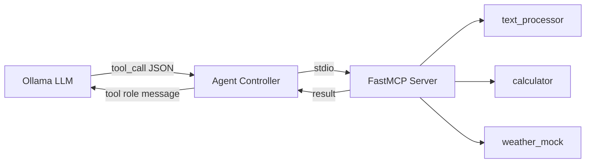

# MCP Tools Reference

This document describes the Model Context Protocol (MCP) tools available to the agent, including their schemas, input/output specifications, and usage examples.

---

## Overview

The agent has access to **three tools** exposed via a FastMCP server that communicates over stdio. When the LLM decides a tool is needed, it generates a structured tool call that the agent controller routes through the MCP client to the tool server.



---

## Tool 1: `text_processor`

Transforms text based on a specified operation.

### Schema

```json
{
  "name": "text_processor",
  "parameters": {
    "type": "object",
    "properties": {
      "text": {
        "type": "string",
        "description": "The text to transform"
      },
      "operation": {
        "type": "string",
        "description": "The transformation operation to apply"
      }
    },
    "required": ["text", "operation"]
  }
}
```

### Supported Operations

| Operation | Description | Example Input | Example Output |
|---|---|---|---|
| `uppercase` | Convert to UPPER CASE | `"hello world"` | `"HELLO WORLD"` |
| `lowercase` | Convert to lower case | `"HELLO WORLD"` | `"hello world"` |
| `wordcount` | Count number of words | `"one two three"` | `"3"` |
| `reverse` | Reverse the string | `"abcdef"` | `"fedcba"` |
| `titlecase` | Convert To Title Case | `"hello world"` | `"Hello World"` |

### Error Handling
- Invalid operation returns: `"Invalid operation 'xxx'. Supported: uppercase, lowercase, wordcount, reverse, titlecase"`
- Operation names are case-insensitive (`"UPPERCASE"` works)

---

## Tool 2: `calculator`

Evaluates arithmetic expressions securely using AST parsing (no `eval()`).

### Schema

```json
{
  "name": "calculator",
  "parameters": {
    "type": "object",
    "properties": {
      "expression": {
        "type": "string",
        "description": "Arithmetic expression to evaluate"
      }
    },
    "required": ["expression"]
  }
}
```

### Supported Operations

| Operator | Description | Example |
|---|---|---|
| `+` | Addition | `"3 + 5"` → `"8"` |
| `-` | Subtraction | `"10 - 3"` → `"7"` |
| `*` | Multiplication | `"4 * 6"` → `"24"` |
| `/` | Division | `"15 / 3"` → `"5"` |
| `%` | Modulo | `"10 % 3"` → `"1"` |
| `**` | Exponentiation | `"2 ** 10"` → `"1024"` |
| `()` | Parentheses | `"(3 + 5) * 2"` → `"16"` |
| `-x` | Unary negation | `"-5 + 3"` → `"-2"` |

### Security Model

The calculator does **not** use Python's `eval()`. Instead, it:
1. Parses the expression into an Abstract Syntax Tree (AST)
2. Walks the tree recursively
3. Only evaluates nodes that match a whitelist of operators
4. Rejects any non-arithmetic constructs (function calls, variables, imports)

### Error Handling
- Division by zero: `"Error: Division by zero"`
- Invalid expressions: `"Error evaluating expression: ..."`
- Unsupported operators: `"Unsupported operator: ..."`

---

## Tool 3: `weather_mock`

Returns synthetic but **deterministic** weather data for any location.

### Schema

```json
{
  "name": "weather_mock",
  "parameters": {
    "type": "object",
    "properties": {
      "location": {
        "type": "string",
        "description": "City or location name"
      }
    },
    "required": ["location"]
  }
}
```

### Response Format

```json
{
  "location": "Toronto",
  "temperature_celsius": 23,
  "humidity_percent": 62,
  "condition": "Partly Cloudy",
  "forecast": "Partly Cloudy with a high of 23°C"
}
```

### Determinism

The weather data is generated using an MD5 hash of the lowercased location name. This means:
- The **same location always returns the same weather** (ideal for testing)
- Different locations produce different weather
- `"LONDON"` and `"london"` produce the same numeric values (case-insensitive hashing)
- The `location` field in the response preserves the original casing

### Possible Conditions

`Sunny`, `Partly Cloudy`, `Cloudy`, `Rainy`, `Thunderstorms`, `Snowy`, `Windy`, `Foggy`

---

## Adding New Tools

To add a new tool, simply add a decorated function to `mcp_server/mcp_server.py`:

```python
@mcp.tool()
def my_new_tool(param1: str, param2: int) -> str:
    """Description of what the tool does."""
    # Your implementation here
    return "result"
```

No changes to the agent controller are needed — the new tool will be automatically discovered via `list_tools()` on the next task execution.
