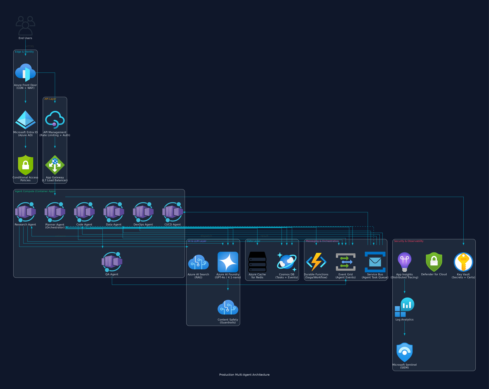
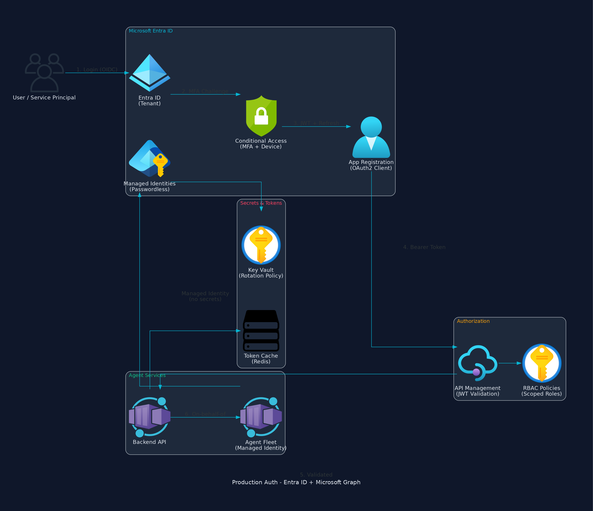
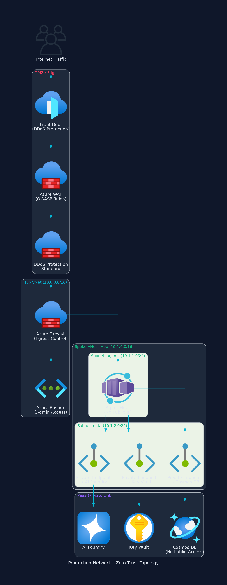
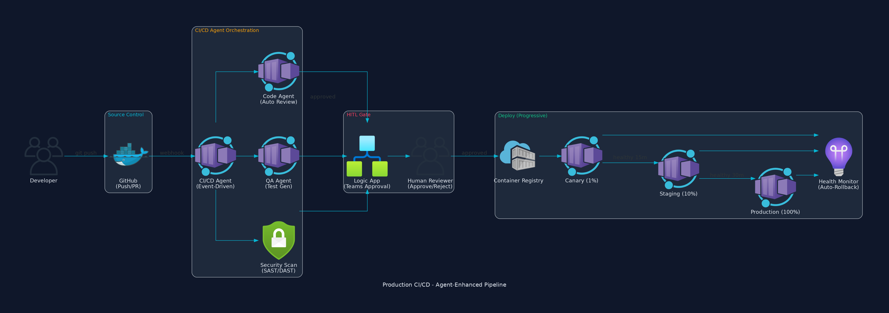
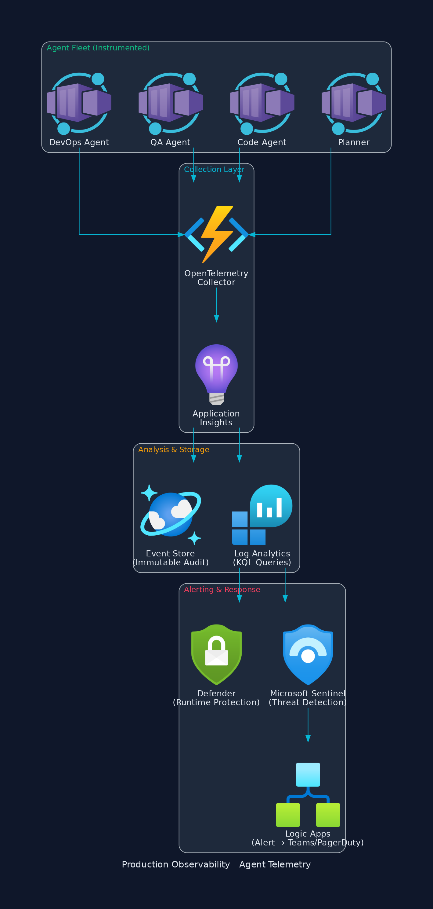

# Production Multi-Agent System Architecture

> **Context**: This document describes the production evolution of the BMO Agentic Execution Framework — from a single ReAct-loop agent to a fully productionized **Multi-Agent System (MAS)** with enterprise-grade security, progressive CI/CD, HITL guardrails, and zero-trust networking on Azure.

---

## Architecture Diagrams

All diagrams generated with the Python `diagrams` library using official Azure cloud icons.

| Diagram | Description |
|---------|-------------|
|  | Full production topology |
|  | Entra ID + Microsoft Graph authentication |
|  | Zero-trust VNet with private endpoints |
|  | Agent-enhanced deployment pipeline |
|  | Distributed tracing + agent metrics |

---

## Table of Contents

1. [Current State vs Production Vision](#current-state-vs-production-vision)
2. [System Architecture](#system-architecture)
3. [Agent Taxonomy](#agent-taxonomy)
4. [Identity & Authentication (Entra ID)](#identity--authentication-entra-id)
5. [Network Security (Zero Trust)](#network-security-zero-trust)
6. [Messaging & Orchestration](#messaging--orchestration)
7. [CI/CD with Autonomous Agents](#cicd-with-autonomous-agents)
8. [HITL Guardrails Framework](#hitl-guardrails-framework)
9. [Observability & Incident Response](#observability--incident-response)
10. [Data Architecture](#data-architecture)
11. [Cost Model & Scaling](#cost-model--scaling)
12. [Implementation Roadmap](#implementation-roadmap)

---

## Current State vs Production Vision

| Dimension | Current (Challenge Scope) | Production MAS |
|-----------|--------------------------|----------------|
| **Agents** | 1 (ReAct loop) | 7+ specialized agents |
| **Orchestration** | Single sequential loop | DAG-based planner with fan-out/fan-in |
| **Tools** | 8 MCP tools (local subprocess) | 50+ tools + external APIs + Microsoft Graph |
| **LLM** | Ollama (local) / GPT-4.1-nano (cloud) | Model routing: GPT-4o (planning) + GPT-4.1-nano (tools) + Claude (code) |
| **Auth** | Token in Key Vault | Microsoft Entra ID + Conditional Access + RBAC |
| **Network** | Public Container App | VNet-isolated + Private Endpoints + WAF + DDoS |
| **CI/CD** | GitHub Actions (static YAML) | Agent-enhanced pipeline with canary + auto-rollback |
| **Guardrails** | Content Safety filter only | 3-tier HITL (auto / notify / approve) |
| **Observability** | App Insights (basic) | Full OpenTelemetry + Sentinel SIEM + agent-level metrics |
| **State** | SQLite / Cosmos DB (simple) | Event-sourced with Change Feed + saga pattern |
| **Compliance** | None | SOC2 / ISO27001 audit trail, PII masking, immutable logs |

---

## System Architecture

**See:** `diagrams/prod_system_architecture.png`

### High-Level Topology

```
Internet → Azure Front Door (WAF + DDoS) → API Management (Auth + Rate Limit)
    → App Gateway (L7 LB) → Agent Fleet (Container Apps, VNet-isolated)
        ↕ Azure Service Bus (task dispatch)
        ↕ Azure AI Foundry (GPT-4o / GPT-4.1-nano with Content Safety)
        ↕ Cosmos DB (event-sourced state, Change Feed)
        ↕ Azure AI Search (RAG for Research Agent)
        ↕ Key Vault (managed identity, no secrets in code)
    Telemetry → App Insights → Log Analytics → Microsoft Sentinel (SIEM)
```

### Core Design Decisions

| Decision | Rationale |
|----------|-----------|
| **Container Apps** over AKS | Per-agent auto-scaling (0→N), no cluster mgmt overhead, built-in Dapr integration |
| **Service Bus** over direct HTTP | Decouples agents, enables async fan-out, dead-letter for failed tasks, at-least-once delivery |
| **Event Grid** for completion events | Push-based delivery to planner, filtered subscriptions per agent type |
| **Durable Functions** for sagas | Handles long-running multi-step workflows with checkpoint/resume and timer-based HITL timeouts |
| **Cosmos DB Change Feed** | Real-time event streaming to other services without polling |
| **Private Endpoints** everywhere | Zero public surface for data services — all traffic stays on Azure backbone |

---

## Agent Taxonomy

### 1. Planner Agent (Orchestrator)

| Property | Value |
|----------|-------|
| **LLM** | GPT-4o (strongest reasoning for decomposition) |
| **Scaling** | Always-on (min 1 replica) |
| **Managed Identity** | `mi-planner` — scoped to Service Bus send + Cosmos DB read/write |
| **HITL** | Presents execution plan before dispatching high-risk subtasks |

**Responsibilities:**
- Parse user intent into a DAG of subtasks
- Assign to child agents via Service Bus topics
- Aggregate results, detect conflicts, re-plan on failure
- Enforce budget/time constraints per-task

### 2. Code Agent

| Property | Value |
|----------|-------|
| **LLM** | Claude Sonnet 4.x (best code generation) / GPT-4o (review) |
| **Tools** | Git API, linter, test runner, code interpreter |
| **Managed Identity** | `mi-code-agent` — scoped to Azure Repos + ACR read |
| **HITL** | **Tier 3** (approval required) for production commits |

### 3. Research Agent

| Property | Value |
|----------|-------|
| **LLM** | GPT-4o-mini (cost-effective for search + synthesis) |
| **Tools** | Bing Search API, Azure AI Search (RAG), PDF parser |
| **Managed Identity** | `mi-research` — scoped to AI Search read |
| **HITL** | Tier 1 (auto) for internal search; Tier 2 (notify) for external APIs |

### 4. Data Agent

| Property | Value |
|----------|-------|
| **LLM** | GPT-4.1-nano (structured output, lowest cost) |
| **Tools** | SQL executor (read-only), pandas, chart generator |
| **Managed Identity** | `mi-data` — scoped to Cosmos DB **read-only** |
| **HITL** | Tier 3 for any write operations; Tier 1 for SELECT queries |

### 5. QA Agent

| Property | Value |
|----------|-------|
| **LLM** | GPT-4o (high accuracy for validation) |
| **Role** | Final gate — validates ALL agent outputs before user delivery |
| **Checks** | Factual accuracy, code correctness (runs tests), security scan, PII detection |
| **Auto-escalation** | If confidence < 85%, routes to human review |

### 6. DevOps Agent

| Property | Value |
|----------|-------|
| **LLM** | GPT-4.1-nano (structured IaC) |
| **Tools** | Terraform executor, `az` CLI, log analyzer, metrics query |
| **Managed Identity** | `mi-devops` — scoped to Container Apps + Monitor read |
| **HITL** | **Always Tier 3** — no autonomous infrastructure changes |

### 7. CI/CD Agent

| Property | Value |
|----------|-------|
| **LLM** | GPT-4.1-nano |
| **Trigger** | Event-driven (GitHub webhook → Event Grid) |
| **Tools** | GitHub API, test orchestrator, ACR push |
| **HITL** | Tier 2 for staging; Tier 3 for production |

---

## Identity & Authentication (Entra ID)

**See:** `diagrams/prod_auth_flow.png`

### Authentication Flow (Production)

```
1. User → Microsoft Entra ID (OIDC login)
2. Entra ID → Conditional Access (MFA + compliant device check)
3. Conditional Access → App Registration (issue JWT + refresh token)
4. User → API Management (Bearer token in Authorization header)
5. APIM → JWT validation (signature, audience, expiry, roles)
6. APIM → Backend API (validated claims in X-MS-CLIENT-PRINCIPAL)
7. Backend → Agent Fleet (on-behalf-of flow OR managed identity)
```

### Key Components

| Component | Azure Service | Purpose |
|-----------|---------------|---------|
| **Identity Provider** | Microsoft Entra ID (Azure AD) | SSO, federation, B2B guest access |
| **MFA / Device Trust** | Conditional Access | Block untrusted devices, require MFA for admin ops |
| **App Registration** | Entra App Registrations | OAuth2 client (frontend SPA + backend API) |
| **API Auth** | API Management (JWT policy) | Validate tokens, extract claims, rate-limit per user |
| **Agent Identity** | Managed Identities (System-Assigned) | Passwordless auth to Azure services — no secrets stored |
| **Secrets Rotation** | Key Vault (auto-rotation policy) | External API keys rotated every 90 days |
| **RBAC** | Entra Roles + Cosmos RBAC | Role-based data access (reader / contributor / admin) |
| **Audit** | Entra Sign-In Logs → Sentinel | All auth events forwarded to SIEM |

### Microsoft Graph Integration

```
Backend uses Microsoft Graph API for:
- Reading user profile (displayName, email, photo) for UI
- Checking group membership for role assignment
- Sending Teams notifications for HITL approvals
- Calendar integration for scheduling agent tasks

Required Graph Permissions:
- User.Read (delegated) — profile info
- GroupMember.Read.All (application) — RBAC group checks  
- ChannelMessage.Send (application) — Teams notifications
- Calendars.Read (delegated) — scheduling context
```

### Entra ID App Registrations

| App | Type | Permissions |
|-----|------|-------------|
| `bmo-agent-spa` | SPA (public client) | `User.Read`, `api://bmo-agent-api/Tasks.ReadWrite` |
| `bmo-agent-api` | Web API (confidential) | `GroupMember.Read.All`, `ChannelMessage.Send` |
| `bmo-agent-daemon` | Daemon (client credentials) | `Application.Read.All` (for health checks) |

---

## Network Security (Zero Trust)

**See:** `diagrams/prod_network_security.png`

### Network Topology

```
┌─────────────────────────────────────────────────────────────────────┐
│ Internet → Azure Front Door (Global LB + WAF + DDoS Protection L4) │
└───────────────────────────────┬─────────────────────────────────────┘
                                │
┌───────────────────────────────▼──────────────────────────────────────┐
│ Hub VNet (10.0.0.0/16)                                               │
│   ├── Azure Firewall (egress filtering, FQDN rules)                  │
│   ├── Azure Bastion (admin jump box, no public IPs on VMs)           │
│   └── VNet Peering → Spoke                                           │
└───────────────────────────────┬──────────────────────────────────────┘
                                │
┌───────────────────────────────▼──────────────────────────────────────┐
│ Spoke VNet - Application (10.1.0.0/16)                               │
│   ├── Subnet: agents (10.1.1.0/24)                                   │
│   │     └── Container Apps Environment (VNet-injected, no public IP) │
│   ├── Subnet: data (10.1.2.0/24)                                     │
│   │     ├── Private Endpoint → Cosmos DB                             │
│   │     ├── Private Endpoint → Key Vault                             │
│   │     ├── Private Endpoint → AI Foundry                            │
│   │     └── Private Endpoint → AI Search                             │
│   └── NSG Rules: deny-all-inbound, allow App Gateway → agents only   │
└──────────────────────────────────────────────────────────────────────┘
```

### Security Controls

| Layer | Control | Implementation |
|-------|---------|----------------|
| **Edge** | DDoS Protection Standard | Auto-mitigation for L3/L4 volumetric attacks |
| **Edge** | WAF (OWASP 3.2) | SQL injection, XSS, request smuggling, bot detection |
| **Edge** | Geo-filtering | Block traffic from non-business regions |
| **Network** | Hub-Spoke VNet | Segmentation — agents isolated from other workloads |
| **Network** | Azure Firewall | Egress filtering — agents can ONLY reach approved FQDNs |
| **Network** | Private Endpoints | All PaaS services accessed over private IP (no public access) |
| **Network** | NSGs | Micro-segmentation — only ALB → agents traffic allowed |
| **Transport** | mTLS (Dapr) | Service-to-service encryption with auto-rotated certs |
| **Identity** | Managed Identity | No credentials in code, secrets, or env vars |
| **Data** | Encryption at rest | AES-256 (Cosmos DB, Key Vault, Blob Storage) |
| **Data** | PII masking | Pre-LLM middleware strips emails, phone numbers, SSNs |
| **Application** | Content Safety | Azure Content Safety v2 on all LLM inputs/outputs |
| **Application** | Prompt injection detection | Input validation middleware before LLM calls |
| **Compliance** | Microsoft Defender for Cloud | Continuous posture assessment, vulnerability scanning |
| **Audit** | Microsoft Sentinel | SIEM with ML-based anomaly detection on agent behavior |

---

## Messaging & Orchestration

### Service Bus Topology

```
Service Bus Namespace: sb-bmo-agent-prod
├── Topic: agent-tasks
│   ├── Subscription: planner-tasks (filter: agent_type = 'planner')
│   ├── Subscription: code-tasks (filter: agent_type = 'code')
│   ├── Subscription: research-tasks (filter: agent_type = 'research')
│   ├── Subscription: data-tasks (filter: agent_type = 'data')
│   ├── Subscription: qa-tasks (filter: agent_type = 'qa')
│   └── Subscription: devops-tasks (filter: agent_type = 'devops')
├── Topic: agent-results
│   └── Subscription: planner-results (all results go to planner)
├── Queue: hitl-approvals (dead-letter after 4h timeout)
└── Queue: dead-letter (failed messages for investigation)
```

### Message Schema

```json
{
  "task_id": "uuid",
  "parent_task_id": "uuid | null",
  "agent_type": "code | research | data | qa | devops | cicd",
  "priority": 0,
  "payload": {
    "prompt": "string",
    "context": {},
    "tools_allowed": ["git", "test_runner"],
    "budget_tokens": 50000,
    "deadline_utc": "2026-06-14T12:00:00Z"
  },
  "hitl_required": false,
  "retry_policy": {
    "max_retries": 3,
    "backoff_seconds": [5, 30, 120]
  }
}
```

### Saga Pattern (Durable Functions)

For multi-agent workflows that must be atomic (all-or-nothing):

```
Saga: DeployNewFeature
├── Step 1: Code Agent → generate code ✓
├── Step 2: QA Agent → run tests ✓
├── Step 3: HITL → await approval ✓ (4h timeout)
├── Step 4: DevOps Agent → canary deploy
│   └── If fails → compensate: rollback canary, notify, log
├── Step 5: Monitor → 15min health check
│   └── If fails → compensate: full rollback, incident created
└── Step 6: DevOps Agent → promote to 100%
```

---

## Azure AI Foundry — Managed Agent Orchestration

In production, the multi-agent system is orchestrated through **Azure AI Foundry** managed services rather than custom code:

### Foundry Services Mapped to Agents

| Foundry Service | Agent It Powers | How |
|----------------|----------------|-----|
| **Model Deployments** | All agents | Each agent type gets its own deployment (GPT-4o for Planner, GPT-4.1-nano for Data/DevOps, Claude for Code) |
| **Prompt Flow** | Planner Agent | Visual DAG builder replaces custom orchestration code — versioned, testable, A/B deployable |
| **Agent Service** | All child agents | Managed compute for agent execution — auto-scales per queue depth, handles retries |
| **Content Safety** | QA Agent input | Every LLM call passes through configurable severity filters (hate, violence, self-harm, sexual) |
| **Evaluation** | QA Agent + CI/CD | Automated eval datasets score agent outputs — fail deploys if accuracy/relevance/groundedness regress |
| **Tracing** | Observability | Every LLM call logged with: model, tokens, latency, cost — feeds into per-agent dashboards |
| **Connections** | Research Agent | Secure access to Azure AI Search, Bing, Microsoft Graph without exposing credentials |
| **Fine-Tuning** | Code Agent | Domain-specific model trained on internal code patterns for better suggestions |
| **Responsible AI** | Compliance layer | PII detection pre-LLM, bias scoring post-LLM, full audit trail |
| **Model Catalog** | Model Router | Access 1900+ models (GPT, Claude, Mistral, Llama, Phi) — swap without code changes |

### Prompt Flow as Planner

```
Prompt Flow: "task_orchestration" (version 3.2.1)
├── Node: intent_classifier (GPT-4.1-nano, <100ms)
│   └── Output: {intent, complexity, required_agents[]}
├── Node: plan_generator (GPT-4o, conditional on complexity > 3)
│   └── Output: {dag: SubTask[], budget_tokens, deadline}
├── Node: dispatch_agents (Python node → Service Bus publish)
│   └── Fan-out to Agent Service instances
├── Node: collect_results (wait for Event Grid completions)
├── Node: qa_validation (GPT-4o, schema-validated)
│   └── Auto-escalate to HITL if confidence < 0.85
└── Node: synthesize_response (GPT-4.1-nano)
    └── Final answer to user
```

### Evaluation Pipeline (CI/CD Integration)

```
On every PR to agent prompts or flow definitions:
1. GitHub Action triggers Foundry Evaluation run
2. Eval dataset: 200 golden test cases per agent type
3. Metrics scored: groundedness, relevance, coherence, fluency, safety
4. Gate: ALL metrics must be ≥ baseline (stored in Cosmos DB)
5. If regression: block merge, create issue, notify team
6. If improvement: auto-approve, log new baseline
```

---

## Unit Tests & Quality Gates

### Current Test Suite

The project includes a comprehensive **pytest** test suite (`backend/tests/test_main.py`) covering:

| Test Category | Count | What's Tested |
|--------------|-------|---------------|
| API endpoints | 12 | CRUD operations, validation, error responses |
| Agent execution | 8 | ReAct loop, tool dispatch, trace recording |
| MCP tools | 8 | Each tool's happy path + edge cases |
| Authentication | 6 | Login flow, token validation, unauthorized access |
| Database layer | 7 | Repository pattern, CRUD, concurrent access |
| Health checks | 3 | LLM status, DB connectivity, overall health |
| Edge cases | 3 | Invalid UUIDs, empty input, malformed JSON |
| **Total** | **47** | |

### Test Strategy (Pre + Post Deploy)

```
Pre-Deploy (CI):
├── pytest -v --tb=short (all 47 unit tests)
├── ESLint + TypeScript compilation (frontend)
└── Docker build validation (catches missing deps)

Post-Deploy (Smoke):
├── GET /api/health → 200 (backend alive)
├── POST /api/task → 201 (agent can execute)
└── GET /api/tasks → 200 (DB connected, data flows)
```

---

## CI/CD with Autonomous Agents

**See:** `diagrams/prod_cicd_pipeline.png`

### Pipeline Stages

| Stage | Agent | Action | HITL Level |
|-------|-------|--------|------------|
| 1. Trigger | CI/CD Agent | Receive webhook, parse diff, identify affected services | Auto |
| 2. Review | Code Agent | Automated code review (style, bugs, security) | Notify |
| 3. Test Gen | QA Agent | Generate tests for new code paths, run full suite | Auto |
| 4. Security | - | SAST (Semgrep), DAST (OWASP ZAP), dependency audit | Auto |
| 5. Build | CI/CD Agent | Docker build with layer caching, push to ACR | Auto |
| 6. Gate | HITL | Human reviews agent findings, approves deploy | **Approve** |
| 7. Canary | DevOps Agent | Deploy to 1% traffic, monitor error rate | Auto |
| 8. Promote | DevOps Agent | 1% → 10% → 50% → 100% with health gates | Notify |
| 9. Monitor | DevOps Agent | Watch metrics 30min post-deploy, auto-rollback on regression | Auto |

### Progressive Canary Rollout

```
Traffic Splitting (Azure Container Apps Revision Weights):

  T+0m:   new=1%   old=99%   ← Deploy canary
  T+15m:  new=10%  old=90%   ← If error_rate < 0.1% && p99 < 2x baseline
  T+30m:  new=50%  old=50%   ← If above holds
  T+60m:  new=100% old=0%    ← Full promotion + HITL notification

  Auto-Rollback Triggers:
  - 5xx error rate > 0.5%
  - p99 latency > 2x baseline
  - Any OOMKilled container
  - QA Agent flags regression in synthetic probes
```

### Self-Healing Pipeline

When a test fails in CI:

```
1. CI/CD Agent detects test failure
2. CI/CD Agent sends failing test + stack trace to Code Agent
3. Code Agent attempts automated fix (max 3 attempts)
4. QA Agent re-runs tests after each fix attempt
5. If fixed → continue pipeline (notify human of auto-fix)
6. If unfixed after 3 attempts → block pipeline, create incident, notify team
```

---

## HITL Guardrails Framework

### Three-Tier Model

| Tier | Risk Level | Behavior | Examples |
|------|-----------|----------|----------|
| **Tier 1: Auto** | Low | Execute immediately, log for audit | Text processing, calculations, read-only queries |
| **Tier 2: Notify** | Medium | Execute + send Teams notification for retroactive review | Research synthesis, code suggestions, staging deploys |
| **Tier 3: Approve** | High | **Pause** until human explicitly approves in Teams/UI | Production deploys, infra changes, external API calls, data writes |

### Approval Workflow Implementation

```
1. Agent reaches HITL decision point
2. Durable Function creates approval record in Cosmos DB
3. Logic App sends adaptive card to Microsoft Teams channel
4. Human clicks Approve/Reject/Modify on card
5. Teams webhook → Logic App → Cosmos DB update
6. Durable Function resumes orchestration
7. If timeout (4 hours) → auto-reject + notify team lead
```

### Risk Scoring Algorithm

```python
def calculate_risk_tier(action: AgentAction) -> int:
    score = 0
    if action.modifies_production:     score += 40
    if action.calls_external_api:      score += 20
    if action.writes_data:             score += 15
    if action.cost_estimate_usd > 1:   score += 10
    if action.agent_confidence < 0.85: score += 15

    if score >= 40: return 3  # Approve required
    if score >= 20: return 2  # Notify
    return 1                   # Auto
```

---

## Observability & Incident Response

**See:** `diagrams/prod_observability.png`

### Agent Telemetry Schema

Every agent emits standardized OpenTelemetry spans:

```json
{
  "trace_id": "abc123",
  "span_name": "agent.code.execute_task",
  "attributes": {
    "agent.type": "code",
    "agent.task_id": "tsk-456",
    "agent.model": "claude-sonnet-4-6",
    "agent.tokens.input": 3200,
    "agent.tokens.output": 890,
    "agent.confidence": 0.92,
    "agent.hitl_escalated": false,
    "agent.cost_usd": 0.0041,
    "agent.tools_called": ["git_diff", "test_runner"],
    "agent.retry_count": 0
  },
  "duration_ms": 4500
}
```

### Dashboards (Azure Workbooks)

| Dashboard | KQL Queries | SLO |
|-----------|-------------|-----|
| Agent Latency | p50/p95/p99 per agent type | p99 < 30s (planning), p99 < 10s (tools) |
| Token Spend | Daily/weekly token consumption per model | < $50/day |
| HITL Metrics | Approval rate, avg wait time, timeout rate | Approval wait < 15 min |
| Error Budget | Error rate by agent, auto-rollback frequency | < 0.1% error rate |
| Cost Allocation | Per-agent, per-user, per-task cost breakdown | Track against $200/mo budget |

### Incident Response (Automated)

```
1. Anomaly detected (Sentinel ML rule: unusual token spend, repeated failures)
2. Severity classified: P1 (production down) / P2 (degraded) / P3 (investigation)
3. P1/P2: Auto-kill affected agent, rollback to last-known-good, page on-call
4. P3: Create investigation task, assign to DevOps Agent for triage
5. All incidents → immutable Cosmos event store for post-mortem
```

---

## Data Architecture

### Event-Sourced State (Cosmos DB)

```
Container: events (partition key: /task_id)
├── event_type: task_created | dag_built | agent_assigned | agent_completed
│              | hitl_requested | hitl_resolved | task_completed | task_failed
├── agent_type: planner | code | research | data | qa | devops | cicd
├── timestamp: ISO 8601
├── payload: {} (agent-specific data)
└── _ts: Cosmos server timestamp (immutable)

Container: projections (partition key: /entity_id)
├── Current state materialized from events via Change Feed
├── task_status: "pending" | "in_progress" | "awaiting_hitl" | "completed" | "failed"
└── Updated by Azure Function triggered on Change Feed
```

### Change Feed Pipeline

```
Cosmos DB Change Feed → Azure Functions → 
├── Update projection (current state)
├── Push to Event Grid (notify planner of completions)
├── Forward to Log Analytics (observability)
└── Archive to Blob Storage (cold storage, compliance)
```

---

## Cost Model & Scaling

### Estimated Monthly Cost (Production)

| Service | SKU | Cost/mo |
|---------|-----|---------|
| Container Apps (7 agents) | Consumption (scale 0→5) | ~$30 |
| Azure AI Foundry (GPT-4o) | Pay-per-token (~2M tokens/day) | ~$60 |
| Azure AI Foundry (GPT-4.1-nano) | Pay-per-token (~5M tokens/day) | ~$15 |
| Cosmos DB | 1000 RU/s (autoscale to 4000) | ~$25 |
| Service Bus | Standard tier | ~$10 |
| Front Door + WAF | Standard tier | ~$35 |
| Key Vault | Standard (1000 ops/mo) | ~$1 |
| App Insights | 5GB/mo (free) + overage | ~$5 |
| Log Analytics | 5GB/mo retention | ~$5 |
| VNet + Private Endpoints | 5 endpoints | ~$10 |
| **Total** | | **~$196/mo** |

### Scaling Strategy

| Component | Trigger | Scale |
|-----------|---------|-------|
| Planner Agent | Always on | Fixed 1-2 replicas |
| Worker Agents | Service Bus queue depth > 5 | 0 → 5 replicas per agent type |
| Cosmos DB | RU consumption > 70% | Autoscale 1000 → 4000 RU/s |
| AI Foundry | Token rate limiting | Multiple deployments with load balancing |

---

## Implementation Roadmap

### Phase 1: Foundation (Weeks 1-4)

- [ ] Migrate auth from Key Vault tokens → Entra ID App Registration
- [ ] Set up Hub-Spoke VNet with Private Endpoints
- [ ] Deploy Service Bus namespace with agent topic/subscriptions
- [ ] Implement Planner Agent with DAG decomposition
- [ ] Add Durable Functions for saga orchestration
- [ ] Wire up Microsoft Graph for Teams notifications

### Phase 2: Agent Fleet (Weeks 5-8)

- [ ] Implement Code Agent (Claude integration + git tools)
- [ ] Implement QA Agent (test generation + validation)
- [ ] Implement Research Agent (Azure AI Search RAG)
- [ ] Implement Data Agent (read-only SQL + pandas)
- [ ] Add async fan-out/fan-in via Service Bus
- [ ] Deploy Conditional Access policies (MFA, device compliance)

### Phase 3: DevOps & CI/CD Automation (Weeks 9-12)

- [ ] Implement DevOps Agent with Terraform/az CLI tools
- [ ] Build CI/CD Agent (GitHub webhook → Event Grid)
- [ ] Implement canary rollout with auto-rollback
- [ ] Self-healing pipeline (auto-fix failing tests)
- [ ] Progressive traffic splitting in Container Apps

### Phase 4: Harden & Scale (Weeks 13-16)

- [ ] Deploy Azure Front Door with WAF rules
- [ ] Enable Microsoft Sentinel with custom detection rules
- [ ] Implement full HITL approval flow via Teams adaptive cards
- [ ] Load testing (Locust) + chaos engineering (Azure Chaos Studio)
- [ ] SOC2 audit trail validation
- [ ] Penetration testing (external firm)
- [ ] Documentation + runbooks for on-call team

---

## Key Differences from Current Implementation

| What exists now | What production adds |
|----------------|---------------------|
| `backend/auth.py` — token in Key Vault | Entra ID + Conditional Access + Microsoft Graph |
| `backend/telemetry.py` — App Insights basic | Full OpenTelemetry + Sentinel SIEM + agent-level custom metrics |
| `backend/agent.py` — single ReAct loop | Planner + 6 specialized child agents communicating via Service Bus |
| `infra/main.tf` — flat resources | Hub-Spoke VNet + Private Endpoints + WAF + DDoS |
| `.github/workflows/deploy.yml` — simple CI/CD | Agent-enhanced pipeline with canary + self-healing + HITL gates |
| `backend/repository.py` — CRUD | Event-sourced with Change Feed projections + saga pattern |

---

> **Note**: This architecture is designed for incremental adoption. Each phase builds on the previous without requiring rewrites. The current BMO Agent codebase already implements the core patterns (ReAct loop, tool calling, streaming, persistence, LLM abstraction, repository pattern) that serve as the direct foundation for Phase 1.
